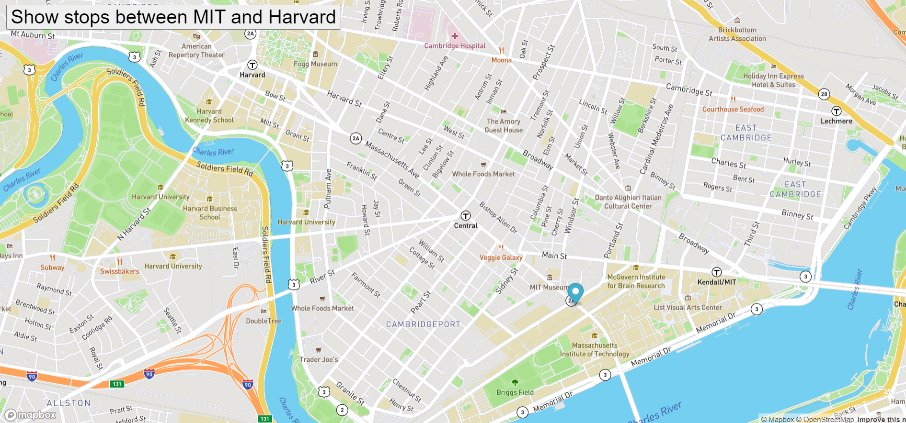
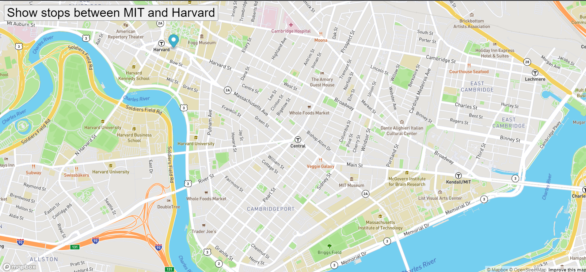

# Real_Time_Bus_Tracker-Week9-

## Description:
 
  This program consists of javascript, html, and img files.
  This program show the map on the screen and show the each busstop with marker from Massachusetts Institute of Technology to Harvard University.

## Installation:
  1. Downloads each file into one file.  
    1. **style.css**  
    2. **index.html**  
    3. **mapanimation.js**  
  2. Click **index.html** and run on the Web browser.
  
## Usage:
  
If successfully installed and run on the Web browser, a map is a marker on the screen, and the marker start to move from Massachusetts Institute of Technology to Harvard University in 1000m seconds.

  
## Support:
  If any question, message me via **[my twitter](https://twitter.com/Kojiro38895598)**.
  
## Roadmap:
  The update is not expected.
  
## License information: 
  Copyright 2021 Kojiro Asano

Permission is hereby granted, free of charge, to any person obtaining a copy of this software and associated documentation files (the "Software"), to deal in the Software without restriction, including without limitation the rights to use, copy, modify, merge, publish, distribute, sublicense, and/or sell copies of the Software, and to permit persons to whom the Software is furnished to do so, subject to the following conditions:

The above copyright notice and this permission notice shall be included in all copies or substantial portions of the Software.

THE SOFTWARE IS PROVIDED "AS IS", WITHOUT WARRANTY OF ANY KIND, EXPRESS OR IMPLIED, INCLUDING BUT NOT LIMITED TO THE WARRANTIES OF MERCHANTABILITY, FITNESS FOR A PARTICULAR PURPOSE AND NONINFRINGEMENT. IN NO EVENT SHALL THE AUTHORS OR COPYRIGHT HOLDERS BE LIABLE FOR ANY CLAIM, DAMAGES OR OTHER LIABILITY, WHETHER IN AN ACTION OF CONTRACT, TORT OR OTHERWISE, ARISING FROM, OUT OF OR IN CONNECTION WITH THE SOFTWARE OR THE USE OR OTHER DEALINGS IN THE SOFTWARE.
